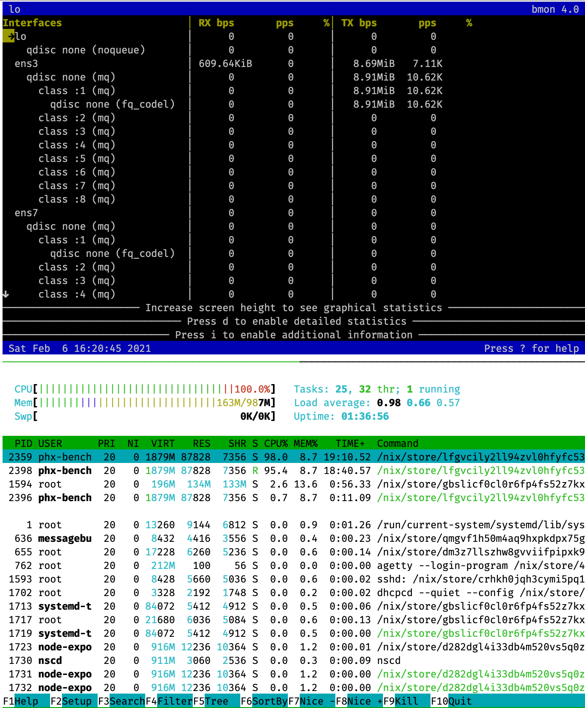

> A demo project for benchmarking Phoenix.

# TOC <!-- :TOC_1: -->
- [Dependencies](#dependencies)
- [What to benchmark?](#what-to-benchmark)
- [Machine Specs](#machine-specs)
- [Tuning](#tuning)
- [Building a release](#building-a-release)
- [Benchmark Results with tuning](#benchmark-results-with-tuning)

# Dependencies

- NixOS
- Erlang R23
- Elixir 1.11.2
- [`wrk`](https://github.com/wg/wrk)

# What to benchmark?

The response time of a request in a standard MVC web application which has no database call.

# Machine Specs

This benchmark uses two **Vultr $5/mo** machines in the same data center:

- Machine A - running `phx-benchmark-demo`
- Machine B - running `wrk`

> I will hide machines' IP in following content and use `IP_A` or `IP_B` for referencing the real IP.

## Network Latency

Testing network latency from Machine B:

```text
$ ping IP_A
PING IP_A (IP_A) 56(84) bytes of data.
64 bytes from 141.164.47.76: icmp_seq=1 ttl=61 time=0.413 ms
64 bytes from 141.164.47.76: icmp_seq=2 ttl=61 time=0.403 ms
64 bytes from 141.164.47.76: icmp_seq=3 ttl=61 time=0.377 ms
64 bytes from 141.164.47.76: icmp_seq=4 ttl=61 time=0.412 ms
64 bytes from 141.164.47.76: icmp_seq=5 ttl=61 time=0.386 ms
```

## CPU

```text
Architecture:                    x86_64
CPU op-mode(s):                  32-bit, 64-bit
Byte Order:                      Little Endian
Address sizes:                   40 bits physical, 48 bits virtual
CPU(s):                          1
On-line CPU(s) list:             0
Thread(s) per core:              1
Core(s) per socket:              1
Socket(s):                       1
NUMA node(s):                    1
Vendor ID:                       GenuineIntel
CPU family:                      6
Model:                           85
Model name:                      Intel Xeon Processor (Cascadelake)
Stepping:                        6
CPU MHz:                         2999.998
BogoMIPS:                        5999.99
Hypervisor vendor:               KVM
Virtualization type:             full
L1d cache:                       32 KiB
L1i cache:                       32 KiB
L2 cache:                        4 MiB
L3 cache:                        16 MiB
```

## RAM

```text
Total online memory:       1G
```

# Tuning

## Tuning OS

Tune Machine A with following command:

```sh
$ ulimit -n 20000000
$ sysctl -w fs.file-max=12000500
$ sysctl -w fs.nr_open=20000500
$ sysctl -w net.ipv4.tcp_mem='10000000 10000000 10000000'
$ sysctl -w net.ipv4.tcp_rmem='1024 4096 16384'
$ sysctl -w net.ipv4.tcp_wmem='1024 4096 16384'
$ sysctl -w net.ipv4.ip_local_port_range='1024 65536'
$ sysctl -w net.core.rmem_max=16384
$ sysctl -w net.core.wmem_max=16384
```

## Tuning BEAM

Edit `rel/vm.args.eex`:

```text
## Increase number of concurrent ports/sockets
+Q 65536
```

## Tuning application

Enable `max_keepalive` so that we run multiple requests on the same connection:

```elixir
config :hello, HelloWeb.Endpoint,
  http: [
    port: String.to_integer(System.get_env("PORT") || "4000"),
    transport_options: [socket_opts: [:inet6]],
    protocol_options: [max_keepalive: 5_000_000]  # added
  ],
  secret_key_base: secret_key_base
```

Suppress logging request:

> Too much logging has a huge impact in performance.

```elixir
config :logger, level: :warn
```

# Building a release

> [Why releases?](https://hexdocs.pm/mix/1.11.3/Mix.Tasks.Release.html#module-why-releases)

```sh
export LANG=en_US.UTF-8
export MIX_ENV=prod

mix local.hex --force
mix local.rebar --force

mix deps.get --only prod
mix compile

mix phx.digest

mix release
```

# Benchmark Results with tuning

## `benchmark/start-c12.sh`

```text
Running 10m test @ http://IP_A:PORT
  12 threads and 12 connections
  Thread Stats   Avg      Stdev     Max   +/- Stdev
    Latency     3.97ms  589.79us  22.75ms   85.49%
    Req/Sec   252.51     19.00   575.00     73.52%
  Latency Distribution
     50%    3.88ms
     75%    4.15ms
     90%    4.51ms
     99%    5.74ms
  1810806 requests in 10.00m, 4.11GB read
Requests/sec:   3017.51
Transfer/sec:      7.02MB
```

## `benchmark/start-c100.sh`

```text
Running 10m test @ http://IP_A:PORT
  100 threads and 100 connections
  Thread Stats   Avg      Stdev     Max   +/- Stdev
    Latency    27.74ms    4.98ms  85.59ms   69.89%
    Req/Sec    36.05      5.95    70.00     54.76%
  Latency Distribution
     50%   27.53ms
     75%   31.03ms
     90%   33.75ms
     99%   41.38ms
  2162426 requests in 10.00m, 4.91GB read
Requests/sec:   3603.50
Transfer/sec:   8.38MB
```

## `benchmark/start-c200.sh`

```text
Running 10m test @ http://IP_A:PORT
  200 threads and 200 connections
  Thread Stats   Avg      Stdev     Max   +/- Stdev
    Latency    56.68ms    4.79ms 145.05ms   82.46%
    Req/Sec    17.64      4.25    40.00     76.57%
  Latency Distribution
     50%   55.70ms
     75%   58.18ms
     90%   61.80ms
     99%   73.79ms
  2116745 requests in 10.00m, 4.81GB read
Requests/sec:   3527.31
Transfer/sec:   8.20MB
```

## `benchmark/start-c400.sh`

```text
Running 10m test @ http://IP_A:PORT
  400 threads and 400 connections
  Thread Stats   Avg      Stdev     Max   +/- Stdev
    Latency   114.13ms   11.18ms 369.13ms   86.79%
    Req/Sec     9.25      1.84    50.00     85.85%
  Latency Distribution
     50%  111.75ms
     75%  116.14ms
     90%  125.89ms
     99%  147.58ms
  2102991 requests in 10.00m, 4.78GB read
Requests/sec:   3504.39
Transfer/sec:   8.15MB
```

## Machine status

As you can see, when runnig the benchmark, machine A is in high load.


